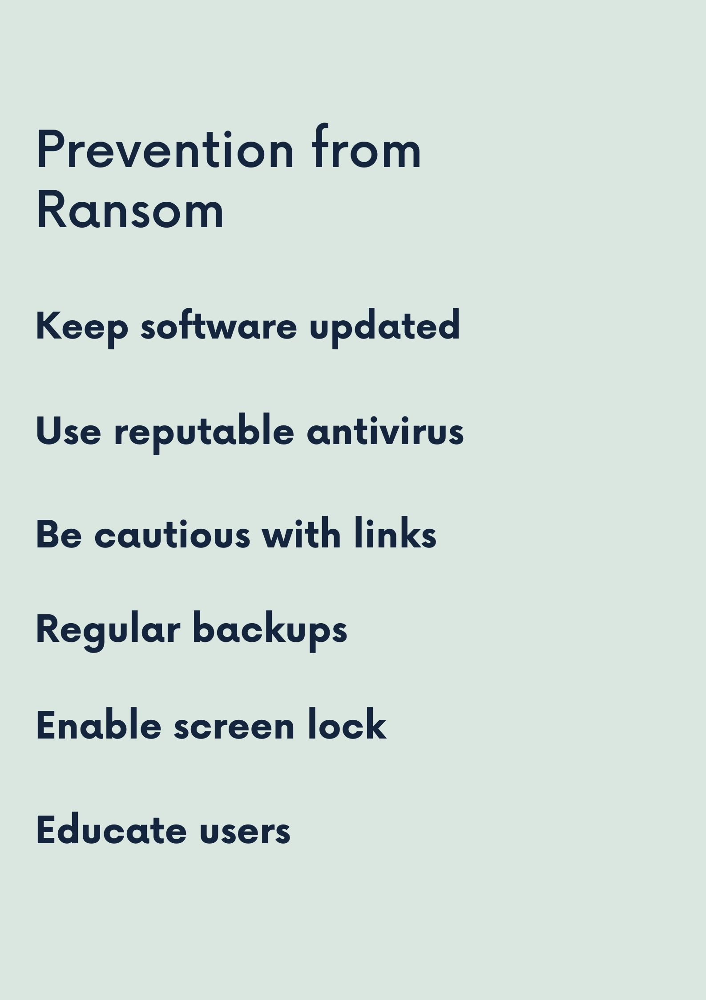

<html lang="en">
<head>
    <meta charset="UTF-8">
    <meta name="viewport" content="width=device-width, initial-scale=1.0">
    <title>Ransomware on Android Awareness</title>
    
</head>
<body>
    <header>
        <h1>Ransomware on Android Awareness</h1>
    </header>
    <main>
        <h2>Welcome</h2>
        
Welcome to our website dedicated to raising awareness about ransomware on Android devices. Explore the following pages to learn more about this growing threat and how to protect yourself.

        
        <nav>
            <ul>
               <li><a href="gave trivia.html">GAME TRIVIA part Beginner!!!</a></li>
                <li><a href="page2.html">What is Ransomware on Android?</a></li>
                <li><a href="page3.html">The Impact of Ransomware</a></li>
                <li><a href="page4.html">Prevention and Mitigation</a></li>
                <li><a href="page5.html">What is the Motivation and Aim</a></li>
                <li><a href="page6.html">What are Some Critical Problems?</a></li>
                <li><a href="page7.html">Solutions to Mitigate from Android Ransom?</a></li>
                <li><a href="page8.html">What is URL Spoofing?</a></li>
                <li><a href="page10.html">How do Hackers Try to Do Ransom?</a></li>
                <li><a href="page12.html">Tips and bits </a></li>
                <li><a href="page13.html">Social Media Sharing </a></li>
                <li><a href="page14.html">Android Ransomware Awareness</a></li>
                <li><a href="page15.html">Recovery Stories</a></li>
                <li><a href="page9.HTML">GAME TRIVIA Final!!!</a></li>
                <li><a href="page11.html">Feedback Form</a>

      
<html lang="en">
<head>
    <meta charset="UTF-8">
    <meta name="viewport" content="width=device-width, initial-scale=1.0">
    <title>Android Ransomware Quiz</title>
    
</head>
<body>

<h1>Android Ransomware Quiz</h1>

    <input type="text" id="username" placeholder="Enter your name">
    <button onclick="startQuiz()">Start Quiz</button>

    

    

    <button id="next" onclick="nextQuestion()">Next Question</button>
    

    

    <h2>Results</h2>
    <table id="result-table">
        <thead>
            <tr>
                <th>Name</th>
                <th>Score</th>
            </tr>
        </thead>
        <tbody>
        </tbody>
    </table>

</body>
</html>

<body>

    <h1>Ransomware on Android</h1>
    

        <!-- Add your image here -->
        
    

    
Ransomware on Android is a type of malicious software specifically designed to target Android mobile devicesssss. Similar to ransomware targeting computers, Android ransomware encrypts the files or locks the device, preventing the user from accessing their data or using their device until a ransom is paid. Here's how Android ransomware typically works:

    <h2 class="infection">Infection:</h2>
    
Android ransomware can infect devices through various means, including malicious apps downloaded from third-party app stores, phishing links, or even legitimate-looking apps that have been compromised.

    <h2 class="encryption">Encryption or Locking:</h2>
    
Once installed on the device, the ransomware may encrypt the files stored on the device's storage or lock the device entirely, preventing the user from accessing their data or using their device.

    <h2 class="ransom-demand">Ransom Demand:</h2>
    
After encrypting or locking the device, the ransomware displays a message demanding payment (usually in cryptocurrency) in exchange for providing the decryption key or unlocking the device. The message often includes instructions on how to pay the ransom.

    <h2 class="threats">Threats:</h2>
    
In some cases, Android ransomware may also threaten the user with consequences such as permanent data loss or the dissemination of sensitive information if the ransom is not paid within a certain timeframe.

    <h2 class="payment">Payment:</h2>
    
If the victim decides to pay the ransom, they are instructed on how to do so, typically through cryptocurrency transactions. However, there is no guarantee that paying the ransom will result in the decryption key or device unlock code being provided.

    
Android Ransomware

    
© 2024 Android Ransomware Awareness

  <meta charset="UTF-8">
    <meta name="viewport" content="width=device-width, initial-scale=1.0">
    <title>The Impact of Ransomware</title>
    
<body>

    <h1 style="text-align: center; color: #009688;">The Impact of Ransomware</h1>
    
Ransomware attacks can have significant and wide-ranging impacts, affecting individuals, businesses, and entire communities. Here are some of the key impacts:

    
    <ul>
        <li class="financial-loss"><strong>Financial Loss:</strong> Ransomware attacks can result in direct financial losses due to the ransom payment demanded by the attackers. Additionally, businesses may suffer indirect financial losses due to downtime, loss of productivity, and the cost of restoring systems and data.</li>
        <li class="data-loss"><strong>Data Loss or Theft:</strong> Ransomware attacks often involve the encryption or theft of sensitive data. If the victim does not have backups or refuses to pay the ransom, they may permanently lose access to their data or have it leaked or sold by the attackers.</li>
        <li class="operational-disruption"><strong>Operational Disruption:</strong> Ransomware attacks can disrupt normal business operations by locking access to critical systems and data. This can result in downtime, loss of revenue, and damage to the organization's reputation.</li>
        <li class="reputation-damage"><strong>Reputation Damage:</strong> Organizations that fall victim to ransomware attacks may suffer reputational damage due to the loss of customer trust and confidence. This can have long-term consequences for their business relationships and market standing.</li>
    </ul>

    

        <!-- Add your image here -->
        
    

   <meta charset="UTF-8">
    <meta name="viewport" content="width=device-width, initial-scale=1.0">
    <title>Prevention and Mitigation</title>
    

<body>

    <h1 style="text-align: center; color: #009688;">Prevention and Mitigation</h1>
    
Ransomware attacks can be devastating, but there are steps you can take to protect yourself and mitigate the impact. Here are some prevention and mitigation measures:

    
    <ol>
        <li><strong style="color: #009688;">Integrate code with security tools and machine learning for ransomware reduction:</strong> Utilize advanced security tools and machine learning algorithms to detect and prevent ransomware attacks in real-time.</li>
        <li><strong style="color: #FF5722;">Daily data backups for contingency in case of incidents:</strong> Regularly back up your important data to secure locations, such as cloud storage or external drives, to ensure you can recover your files in case of a ransomware attack.</li>
        <li><strong style="color: #FFC107;">Download apps only from official stores like Play Store:</strong> Avoid downloading apps from third-party sources, as they may contain malicious code. Stick to reputable app stores like Google Play Store for downloading apps.</li>
        <li><strong style="color: #673AB7;">Stay informed about the latest security measures:</strong> Keep yourself updated about the latest developments in cybersecurity and ransomware prevention techniques. Subscribe to security blogs, forums, and newsletters to stay informed about emerging threats.</li>
        <li><strong style="color: #03A9F4;">Prioritize online safety through education and awareness:</strong> Educate yourself and your organization about ransomware threats and best practices for prevention. Conduct regular cybersecurity awareness training sessions to ensure everyone knows how to recognize and respond to ransomware attacks effectively.</li>
    </ol>

    

       
        
    

<html lang="en">
<head>
    <meta charset="UTF-8">
    <meta name="viewport" content="width=device-width, initial-scale=1.0">
    <title>Motivation and Aim of Ransomware</title>
    
<body>

    <h1>Motivation and Aim of Ransomware</h1>
    

        <!-- Add your image here -->
        
    

    
Ransomware attacks are motivated by various factors and aims, including:

    <ul>
        <li class="financial"><strong>Financial Gain:</strong> One of the primary motivations behind ransomware attacks is financial gain. Attackers aim to extort money from individuals, businesses, or organizations by encrypting their files or locking their devices and demanding payment (usually in cryptocurrency) in exchange for providing the decryption key or unlocking the device.</li>
        <li class="disruption"><strong>Disruption and Chaos:</strong> Some attackers may aim to cause disruption and chaos by targeting critical infrastructure, essential services, or high-profile organizations.</li>
        <li class="revenge"><strong>Revenge or Retaliation:</strong> In some cases, ransomware attacks may be motivated by personal grievances or vendettas against specific individuals, businesses, or organizations. Attackers may seek revenge for perceived wrongs or seek to retaliate against competitors, rivals, or adversaries.</li>
        <li class="political"><strong>Political or Ideological Motives:</strong> Certain ransomware attacks may be motivated by political or ideological beliefs. Hacktivist groups or state-sponsored actors may target specific organizations or governments to promote a particular agenda, protest against perceived injustices, or disrupt political or social systems.</li>
        <li class="espionage"><strong>Espionage and Intelligence Gathering:</strong> In some cases, ransomware attacks may be used as a cover for espionage or intelligence gathering activities. Attackers may use ransomware to encrypt or steal sensitive data, such as trade secrets, intellectual property, or classified information, for use in future attacks or for sale on the black market.</li>
    </ul>

 <meta charset="UTF-8">
    <meta name="viewport" content="width=device-width, initial-scale=1.0">
    <title>Critical Problems Caused by Ransomware</title>
    
<body>

    <h1>Critical Problems Caused by Ransomware</h1>
    

        <!-- Add your image here -->
        
    

    <ul>
        <li class="data-loss"><strong>Data Loss and Theft:</strong> Ransomware attacks can result in the loss or theft of sensitive data, including personal information, financial records, intellectual property, and proprietary business data.</li>
        <li class="financial-loss"><strong>Financial Losses:</strong> Ransomware attacks can cause direct financial losses due to ransom payments, as well as indirect costs associated with downtime, lost productivity, forensic investigations, data recovery efforts, and legal expenses.</li>
        <li class="reputational-damage"><strong>Reputational Damage:</strong> Organizations that fall victim to ransomware attacks may suffer reputational damage due to the loss of customer trust and confidence.</li>
        <li class="operational-disruption"><strong>Operational Disruption:</strong> Ransomware attacks can disrupt normal business operations by locking access to critical systems and data, causing downtime, and disrupting supply chains and service delivery.</li>
        <li class="infrastructure-vulnerabilities"><strong>Critical Infrastructure Vulnerabilities:</strong> Ransomware attacks targeting critical infrastructure can have severe consequences for public safety, national security, and economic stability.</li>
    </ul>

    <meta charset="UTF-8">
    <meta name="viewport" content="width=device-width, initial-scale=1.0">
    <title>Protecting Your Android Device from Ransomware</title>
    
<body>

<h1>Protecting Your Android Device from Ransomware</h1>

    <h3>1. Install Antivirus Software</h3>
    
Antivirus software can detect and remove ransomware from your device.

    
Recommended antivirus apps:

    <ul>
        <li><a href="#">Avast Mobile Security</a> - Offers real-time protection, scanning of installed apps and memory card content, and anti-theft features.</li>
        <li><a href="#">Bitdefender Mobile Security</a> - Provides on-demand and on-install scanning, anti-theft features, app lock, and web security.</li>
        <li><a href="#">Norton Mobile Security</a> - Includes antivirus, anti-malware, and anti-phishing features, as well as app scanning and privacy protection.</li>
    </ul>
    
Install an antivirus app from a reputable provider and keep it updated regularly to stay protected against the latest threats.

    <h3>2. Keep Software Up-to-Date</h3>
    
Regularly update your device's operating system and apps to patch security vulnerabilities.

    
Go to Settings > About phone > Software update to check for updates.

    
Enable automatic updates for added convenience and security. Additionally, consider enabling automatic app updates from the Google Play Store.

    <h3>3. Avoid Suspicious Links and Downloads</h3>
    
Be cautious when clicking on links or downloading files from unknown sources.

    
Only download apps from the official Google Play Store to reduce the risk of malware. Avoid sideloading apps from third-party sources unless absolutely necessary.

    
Use a secure browser with built-in protection against malicious websites. Look out for HTTPS encryption and verify website URLs before entering sensitive information.

    <h3>4. Back Up Important Data</h3>
    
Regularly back up your data to a secure location to prevent loss in case of a ransomware attack.

    
Use cloud storage services like Google Drive, Dropbox, or OneDrive for convenient and secure backups. Ensure that automatic backup features are enabled for important data such as photos, videos, and documents.

    
Consider using a dedicated backup app for additional control and customization. Test your backups periodically to ensure their integrity and accessibility.

    <meta charset="UTF-8">
    <meta name="viewport" content="width=device-width, initial-scale=1.0">
    <title>URL Spoofing</title>
    
<body>

    <h1 style="text-align: center; color: #009688;">What is URL Spoofing?</h1>
    
A spoofed URL is a fraudulent link that is masked to look like a legitimate source in order to steal your data.

    

        <h3>4 MAIN WAYS OF URL Spoofing</h3>
        
<strong>1. Misspelled links:</strong> People tend to skim read messages, which means hackers can send phishing emails with links that look just like trusted ones. It is enough to just change 1 character to register a new domain.

        
<strong>2. URL Shorteners:</strong> Another common way to spoof URLs is by using URL shorteners like bit.ly. However, they also make it easier for scammers to hide malicious links.

        
<strong>3. Links behind buttons or words:</strong> Hackers may send phishing emails pretending to be a trusted source and hyperlink malicious links to buttons or words. This trick is still used today, but it's relatively easy to spot.

        
<strong>4. Links with non-Latin Characters:</strong> The use of new scripts to register domains has created more opportunities for hackers. They can now use non-Latin characters to create homographic URLs, which look like Latin characters but come from a different alphabet. These URLs can deceive internet users into clicking on malicious links.

    

    
<strong>Android Ransomware</strong> © 2024 Android Ransomware Awareness

  <meta charset="UTF-8">
    <meta name="viewport" content="width=device-width, initial-scale=1.0">
    <title>Android Ransomware Quiz</title>
    

<body>

<!DOCTYPE html>
<html lang="en">
<head>
    <meta charset="UTF-8">
    <meta name="viewport" content="width=device-width, initial-scale=1.0">
    <title>Android Ransomware Quiz</title>
    
</head>
<head>
    <meta charset="UTF-8">
    <meta name="viewport" content="width=device-width, initial-scale=1.0">
    <title>Android Ransomware Quiz</title>
    
</head>
<body>

<h1>Android Ransomware Quiz</h1>

    <input type="text" id="username" placeholder="Enter your name">
    <button onclick="startQuiz()">Start Quiz</button>

    

    

    <button id="next" onclick="nextQuestion()">Next Question</button>
    

    

    <h2>Results</h2>
    <table id="result-table">
        <thead>
            <tr>
                <th>Name</th>
                <th>Score</th>
            </tr>
        </thead>
        <tbody>
        </tbody>
    </table>

</body>
</html>

<body>

    <h1 style="text-align: center; color: #009688;">How do Hackers Try to Do Ransom?</h1>
    
Hackers attempt to carry out ransomware attacks through various methods, but the primary objective is to gain unauthorized access to a system or network, encrypt important files or data, and then demand payment (usually in cryptocurrency) from the victim to provide the decryption key. Here's a general overview of how hackers typically execute ransomware attacks:

    
    

        <h3>Phishing Emails</h3>
        
One common method is through phishing emails. Attackers send emails that appear to be from legitimate sources, often containing malicious links or attachments. When users click on these links or download attachments, it installs the ransomware onto their system.

    

    

        <h3>Exploiting Vulnerabilities</h3>
        
Hackers exploit vulnerabilities in software or operating systems to gain access to systems or networks. They often target systems that haven't been updated with the latest security patches, making them more susceptible to exploitation.

    

    

        <h3>Remote Desktop Protocol (RDP) Attacks</h3>
        
Attackers may exploit weak or default credentials for Remote Desktop Protocol (RDP) connections to gain access to systems. Once inside, they can deploy ransomware across the network.

    

    

        <h3>Social Engineering</h3>
        
Sometimes hackers use social engineering techniques to trick employees or users into providing access credentials or other sensitive information, which they then use to access systems and deploy ransomware.

    

    

        <h3>Brute Force Attacks</h3>
        
Hackers use automated tools to repeatedly guess usernames and passwords until they gain access to a system or network. Once inside, they deploy ransomware.

    

    
<strong>Android Ransomware</strong> © 2024 Android Ransomware Awareness

<meta charset="UTF-8">
    <meta name="viewport" content="width=device-width, initial-scale=1.0">
    <title>Android Ransomware Awareness</title>
    
<body>
    

        <h1>Android Ransomware Awareness</h1>
        
Welcome to our website dedicated to raising awareness about Android ransomware. We value your feedback!

        <form action="#" method="post">
            <label for="name">Name:</label>
            <input type="text" id="name" name="name" required>

            <label for="email">Email:</label>
            <input type="email" id="email" name="email" required>

            <label for="feedback">Feedback/Question/Issue:</label>
            <textarea id="feedback" name="feedback" rows="5" required></textarea>

            <input type="submit" value="Submit">
        </form>
    

<meta charset="UTF-8">
    <meta name="viewport" content="width=device-width, initial-scale=1.0">
    <title>Personalized Tips for Cybersecurity</title>
    
<body>
    

        <h1>Personalized Tips for Cybersecurity</h1>
        
Here are some personalized tips and recommendations based on your browsing behavior:

        <!-- Placeholder for personalized tips -->
        

            

                <h3>Tip 1: Use Strong Passwords</h3>
                
Ensure your passwords are complex and unique for each account to prevent unauthorized access.

            

            

                <h3>Tip 2: Enable Two-Factor Authentication (2FA)</h3>
                
Enhance your account security by enabling two-factor authentication wherever possible.

            

            <!-- You can add more personalized tips here -->
        

    

    <!-- Script to fetch personalized tips from the backend -->
    

<!DOCTYPE html>
<html lang="en">
<head>
    <meta charset="UTF-8">
    <meta name="viewport" content="width=device-width, initial-scale=1.0">
    <title>Share Cybersecurity Tips</title>
    
</head>
<body>
    

        <h1>Share Cybersecurity Tips</h1>
        
Help spread awareness about cybersecurity by sharing valuable tips with your friends and followers!

        

            

                
            

            

                
            

            

                
            

            

                
            

            <!-- Add more social media buttons as needed -->
        

    

    <!-- JavaScript functions for social media sharing -->
    
</body>
</html>

    

        <h1>Android Ransomware Awareness</h1>

        <!-- Downloadable Guides Section -->
        

            <h2 class="section-title">Downloadable Guides</h2>
            

                

                    <h3>Guide 1: Protecting Against Ransomware</h3>
                    
This guide covers the best practices to keep your devices safe from ransomware attacks, including tips on secure browsing, software updates, and more.

                    <a href="https://www.cisa.gov/stopransomware/how-can-i-protect-against-ransomware" class="button">Click the link</a>
                

                

                    <h3>Guide 2: Steps to Take if Infected</h3>
                    
If you suspect your device is infected, this guide provides step-by-step instructions on immediate actions to minimize damage and recover your data.

                    <a href="https://www.avast.com/c-how-to-remove-ransomware-android#:~:text=Focus%20on%20prevention%201%201.%20Immediately%20isolate%20infected,dealing%20with.%20...%203%203.%20Remove%20the%20ransomware" class="button">Click the link</a>
                

                

                    <h3>Guide 3: Recovery Plan</h3>
                    
Develop a comprehensive recovery plan with this guide, including backup strategies, data recovery options, and how to prevent future attacks.

                    <a href="https://www.crowdstrike.com/cybersecurity-101/ransomware/ransomware-recovery/" class="button">Click the link</a>
                

            

        

        <!-- Tool Recommendations Section -->
        

            <h2 class="section-title">Tool Recommendations</h2>
            

                

                    <h3>Tool 1: Antivirus Software</h3>
                    
Protect your devices with top-rated antivirus software. Check out our recommendations for the best options available.

                    <a href="https://www.malwarebytes.com/mwb-download" class="button" target="_blank">View Tools</a>
                

                

                    <h3>Tool 2: Ransomware Protection</h3>
                    
Discover specialized tools designed to prevent and remove ransomware from your devices. Learn more about these essential tools.

                    <a href="https://www.kaspersky.com/anti-ransomware-tool" class="button" target="_blank">View Tools</a>
                

                

                    <h3>Tool 3: Backup Solutions</h3>
                    
Ensure your data is safe with reliable backup solutions. Explore our top picks for cloud and local backup services.

                    <a href="https://www.techradar.com/best/best-backup-software" class="button" target="_blank">View Tools</a>
                

            

        

    

  <meta charset="UTF-8">
    <meta name="viewport" content="width=device-width, initial-scale=1.0">
    <title>Recovery Stories</title>
    
<body>
    

        <h1>Recovery Stories</h1>

        <!-- Recovery Stories Section -->
        

            <h2 class="section-title">Success Stories</h2>
            

                

                    

                        <h3>Story 1: ABC Corp's Swift Recovery</h3>
                        
ABC Corp faced a severe ransomware attack that encrypted their critical data. Learn how they swiftly recovered using robust backup strategies and professional cybersecurity help. <a href="https://www.csoonline.com/article/3533453/ransomware-attacks-case-studies-and-examples.html" class="external-link" target="_blank">Read full story</a>

                        <a href="https://www.marshmclennan.com/insights/publications/2021/may/surviving-a-ransomware-attack.html" class="button" target="_blank">Read More</a>
                    

                

                

                    

                        <h3>Story 2: Freelance Designer's Data Rescue</h3>
                        
When a freelance designer's work files were locked by ransomware, they feared losing everything. Discover how regular backups and quick action saved their business. <a href="https://www.bbc.com/news/technology-54427092" class="external-link" target="_blank">Read full story</a>

                        <a href="https://blog.icons8.com/articles/the-best-cybersecurity-practices-for-freelance-designers/" class="button" target="_blank">Read More</a>
                    

                

                

                    

                        <h3>Story 3: Healthcare Provider's Secure Recovery</h3>
                        
A healthcare provider's patient data was targeted by a ransomware attack. Find out how they protected sensitive information and restored operations without paying the ransom. <a href="https://www.zdnet.com/article/how-this-hospital-recovered-from-a-ransomware-attack-without-paying-the-ransom/" class="external-link" target="_blank">Read full story</a>

                        <a href="https://www.ncbi.nlm.nih.gov/pmc/articles/PMC9856685/" class="button" target="_blank">Read More</a>
                    

                

                

                    

                        <h3>Story 4: Small Business's Fight Back</h3>
                        
A small business's systems were compromised by ransomware. Learn about their recovery journey and the steps they took to fortify their cybersecurity defenses. <a href="https://www.kaspersky.com/blog/small-business-recovery-ransomware/38604/" class="external-link" target="_blank">Read full story</a>

                        <a href="https://www.researchgate.net/publication/380360965_Cybersecurity_Challenges_and_Solutions_for_Small_Businesses" class="button" target="_blank">Read More</a>
                    

                

            

        

    

</body>

